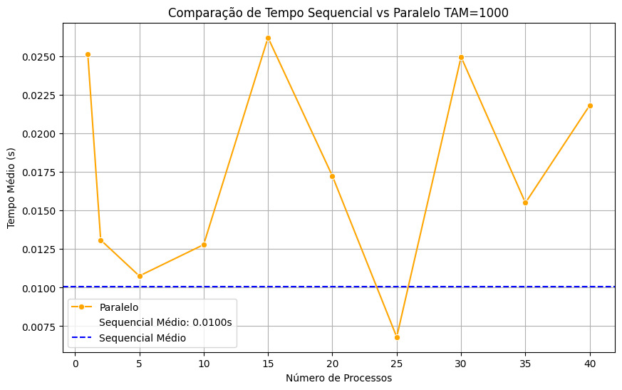
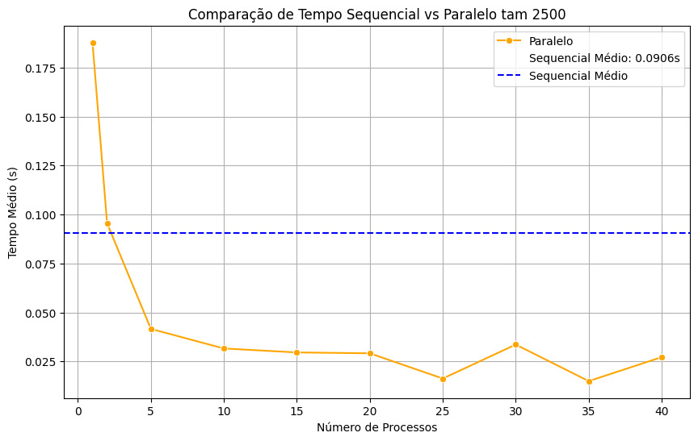
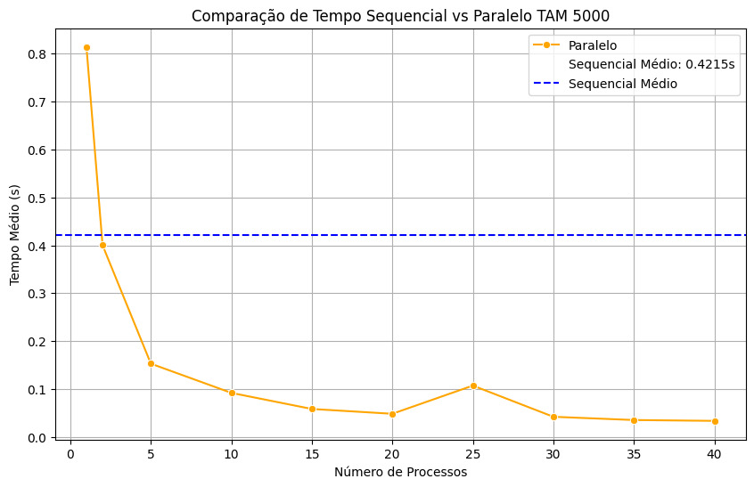
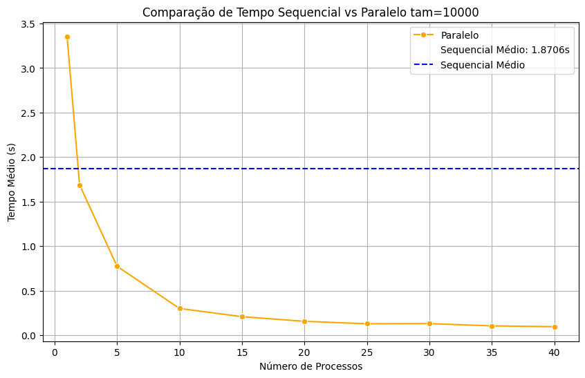
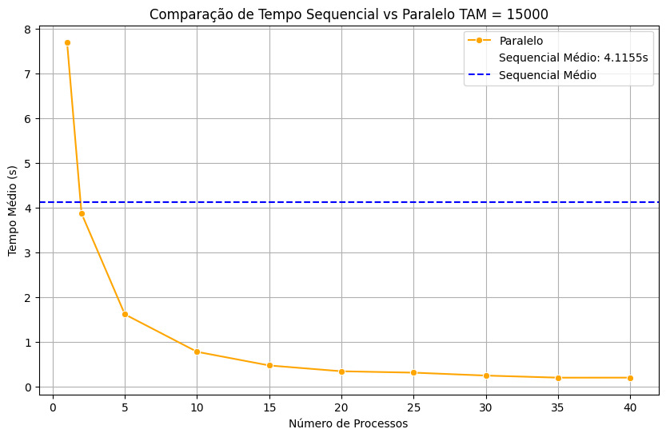

# Projeto: Implementação e Comparação de Operações em Matriz com MPI

Este projeto prático visa implementar e comparar o desempenho de operações em matriz de forma sequencial e paralela utilizando a biblioteca MPI (Message Passing Interface). O programa desenvolvido realiza diversas operações sobre uma matriz, incluindo a identificação do maior e menor elemento, a soma de todos os elementos, a soma dos elementos de cada linha e a soma dos elementos de cada coluna.

## 1. Introdução

O objetivo deste projeto é explorar e demonstrar os benefícios da computação paralela em operações matriciais. A utilização de MPI permite a distribuição de tarefas entre múltiplos processadores, visando a redução do tempo de execução e a melhoria da eficiência computacional.

## 2. Funcionalidades

O programa desenvolvido realiza as seguintes operações em uma matriz:
- Identificação do maior elemento
- Identificação do menor elemento
- Soma de todos os elementos
- Soma dos elementos de cada linha
- Soma dos elementos de cada coluna

## 3. Desempenho

