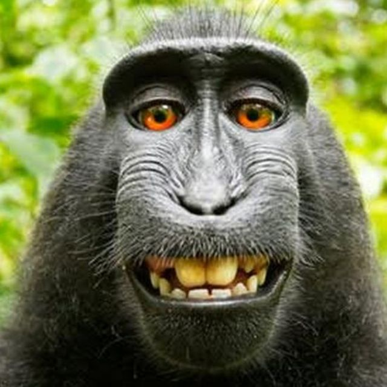
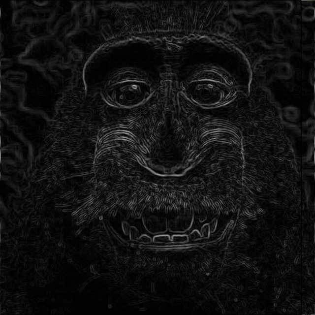

# Implementação do Filtro de Sobel

## Introdução

Para o trabalho prático, optou-se pela implementação do filtro de Sobel. O filtro de Sobel é uma técnica comumente usada em processamento de imagem para realçar bordas. Ele utiliza convolução para calcular uma aproximação do gradiente da imagem, destacando áreas de intensidade de pixel significativamente diferentes. O filtro de Sobel é frequentemente aplicado a imagens em tons de cinza, embora também possa ser usado em imagens coloridas separadamente para cada canal de cor.

## Estruturação Matemática

O filtro de Sobel usa duas máscaras (kernels) separadas, uma para detectar mudanças na intensidade na direção horizontal e outra para detectar mudanças na direção vertical. As máscaras são as seguintes:

$$
g_x =
\\begin{bmatrix}
1 & 2 & 1 \\\\
0 & 0 & 0 \\\\
-1 & -2 & -1
\\end{bmatrix}
$$

$$
g_y =
\\begin{bmatrix}
-1 & 0 & 1 \\\\
-2 & 0 & 2 \\\\
-1 & 0 & 1
\\end{bmatrix}
$$

O processo de convolução envolve a aplicação dessas máscaras à imagem original. Para cada pixel na imagem, a convolução é realizada multiplicando os valores da máscara pelos valores dos pixels correspondentes na vizinhança do pixel em questão e somando esses produtos. Isso é feito separadamente para as máscaras $g_x$ e $g_y$.

$$
G_x = 
\\begin{bmatrix}
-1 & 0 & 1 \\\\
-2 & 0 & 2 \\\\
-1 & 0 & 1
\\end{bmatrix}
\\ast
\\begin{bmatrix}
a_{11} & a_{12} & a_{13} \\\\
a_{21} & a_{22} & a_{23} \\\\
a_{31} & a_{32} & a_{33}
\\end{bmatrix}
$$

$$
G_x = (-1 \cdot a_{11}) + (0 \cdot a_{12}) + (1 \cdot a_{13}) +
      (-2 \cdot a_{21}) + (0 \cdot a_{22}) + (2 \cdot a_{23}) +
      (-1 \cdot a_{31}) + (0 \cdot a_{32}) + (1 \cdot a_{33})
$$

$$
G_y =
\\begin{bmatrix}
1 & 2 & 1 \\\\
0 & 0 & 0 \\\\
-1 & -2 & -1
\\end{bmatrix}
\\ast
\\begin{bmatrix}
a_{11} & a_{12} & a_{13} \\\\
a_{21} & a_{22} & a_{23} \\\\
a_{31} & a_{32} & a_{33}
\\end{bmatrix}
$$

$$
G_y = (1 \cdot a_{13}) + (2 \cdot a_{23}) + (1 \cdot a_{33}) +
      (0 \cdot a_{12}) + (0 \cdot a_{22}) + (0 \cdot a_{32}) +
      (-1 \cdot a_{11}) + (-2 \cdot a_{21}) + (-1 \cdot a_{31})
$$

A magnitude do gradiente resultante é calculada combinando as componentes horizontal e vertical usando a seguinte fórmula:

$$
G = \\sqrt{G_x^2 + G_y^2}
$$

Para obter o valor do pixel do detector de borda, é utilizado o valor normalizado pela máxima magnitude do gradiente com a seguinte fórmula:

$$
P_{ij} = \\dfrac{G_{ij} \\cdot 255}{G_{max}}
$$

Com a aplicação desse algoritmo, obtém-se a imagem com os contornos destacados, como é possível observar na figura abaixo:

*Figura 1: Imagem antes e depois da aplicação do filtro de Sobel*

## Referências

- Sobel, I. (1968). A 3x3 Isotropic Gradient Operator for Image Processing. Presented at the Stanford Artificial Intelligence Project (SAIL).
